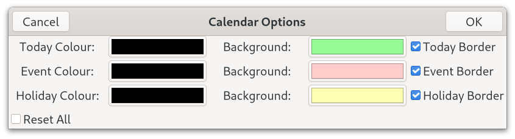
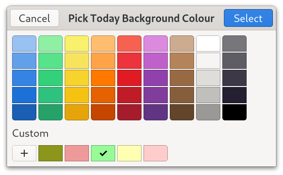

# Talk Calendar (Gtk4 Version)

Talk Calendar is a Linux personal desktop calendar with some speech capability.


 
## Deployment

### Binary Image

A 64 bit binary image is available and can be downloaded from [bin-packages](https://github.com/crispinalan/talkcalendar/tree/main/bin-packages) and can be used with Linux distributions that have Gtk4 in their repositories such as Fedora 35, Debian Bookworm (in testing) and Ubuntu 21.10* etc. 

Assuming that the Gtk4 base libraries are installed the Talk Calendar binary can be run from the terminal using: 

```
./talkcalendar
```

Audio output requires that the alsa-utils package (usually installed by default) and the espeak package are installed. For Fedora systems use

```
sudo dnf install espeak
```
For Debian based systems use

```
sudo apt install espeak
```

Use a menu editor such as [MenuLibre](https://github.com/bluesabre/menulibre) to create a launcher for Talk Calendar. MenuLibre allows the working directory to be set as shown below. 


The database called "eventsdb.csv" is located in the working directory. With Talk Calendar you can use the following menu item
 
```
Help->Information
```
to show the current working directory where both the speech engine and the events database should be located with the correct permissions.

Using the binary image together with a menu editor is a universal approach for getting Talk Calendar installed on most Gtk4 distros.


*With Ubuntu 21.10 the base Gtk4 libraries can be installed using
```
sudo apt install libgtk-4-1
```
Alternatively, Talk Calendar can be built from source using the code in this repository. See notes below which explain how to do this.

 
```
Help->Information
```
to show the current working directory where both the speech engine and the events database should be located with the correct permissions.

## Talk Calendar Usage

### Adding New Event

* Select event date using the calendar.
* Click the New button on the headerbar to invoke the "New Event" dialog.
* Enter the event title.
* Enter the location.
* Enter start and end times. 
* Events are sorted by start time when displayed.
* A colour marker is placed on a day in the calendar which has an event.
* Navigate through the year using the calendar to add events.


### Editing Existing Event

* Select the event in the list view and click the Edit button on the headerbar to edit.
* Change details as appropriate.

### Preferences

* Use the Preferences section in the hamburger menu to change options such as talk, talk at startup, show public holidays, use adwaita icons etc.


### Font

With GNOME you change the desktop 'font-name' and 'document-font-name' using gsettings.

Cantarell is the default font supplied with GNOME since version 3.0. Fedora ships with 'Cantarell 11' as the default font. This can be checked using the following commands.

```
gsettings get org.gnome.desktop.interface font-name 
gsettings get org.gnome.desktop.interface document-font-name
```
Talk Calendar uses the default GNOME desktop font-name.

To change the desktop font to say 'Sans 11' you would use the following commands.
```
gsettings set org.gnome.desktop.interface document-font-name 'Sans 11'
gsettings set org.gnome.desktop.interface font-name 'Sans 11'
```

Talk Calendar allows the calendar font size to be changed using the Preferences Dialog. The actual size of the calendar font depends on the GNOME text scaling factor which can found using the following command.

```
gsettings get org.gnome.desktop.interface text-scaling-factor
```
For a larger font size, the text-scaling factor is typically set to 1.3 using the following command.
```
gsettings set org.gnome.desktop.interface text-scaling-factor 1.3
```

To reset the text scaling factor use.
```
gsettings reset org.gnome.desktop.interface text-scaling-factor
```

The current system desktop font, the GNOME text scaling factor and the Talk Calendar font size chosen by the user are shown in the information panel in the Help menu section.


### Help

* Use the Information dialog to display current application preferences.


* Use the About dialog to display current version.


### Keyboard Shortcuts
```
Speak		Spacebar
Today		Home Key
About		<Ctrl>A
Version		<Ctrl>V
Quit		<Ctrl>Q
```

### Talk

* Enable talking in options (use the preferences menu item in the hamburger menu)
* Enable "Talk At Startup" in preferences to read out the date and event types for the current day when the calendar is started
* Click on a calendar date with events
* Press the spacebar to speak or use the speak menu item


### Calendar Settings

* Use the Calendar Settings item in the hamburger menu to change colour and border options for the current day (today), event days and holidays





## Startup Applications

Add Talk Calendar to your start-up programs to read out events when the computer is switched on.

With the Gnome desktop use the Gnome "Tweak Tool" to add Talk Calendar to your startup applications.


## Build From Source

The C source code for Talk Calendar is provided in the src directory.

You need the Gtk4 development libraries and the gcc compiler. 

With Debian Bookworm you need to install the following packages

```
apt install build-essential
apt install libgtk-4-dev
apt install gtk-4-examples
apt install libglib2.0-dev
apt install alsa-utils
```
The packages:
```
apt install libglib2.0-dev
apt install alsa-utils
```
are needed but should be installed by default

With Fedora you need to install the following packages.

```
sudo dnf install gtk4-devel
sudo dnf install gtk4-devel-docs
sudo dnf install glib-devel
sudo dnf install alsa-lib-devel
```

I used Geany as the IDE for developing the project as it has an integrated terminal. 

To compile use

```
gcc $(pkg-config --cflags gtk4) -o talkcalendar main.c $(pkg-config --libs gtk4) -lm
```


## Wayland

Talk Calendar is being developed and tested using Fedora 35 GNOME using the Wayland display compositor and no problems have been detected with Wayland.


## Core Features

* built with Gtk4.0
* event title, location, type, start and end time can be entered and edited
* bespoke month calendar which allows days with events to be colour marked
* priority events can be separately colour marked
* current version uses espeak speech sythensizer
* bespoke flat-file csv database with memory dynamically allocated for up to 5000 records
* binary for 64-bit Gtk4 distributions 


## Roadmap
```
fix speech for repeating yearly events
code refactoring and enhancements
event overlap alert
scan for upcoming events
```

## Versioning

[SemVer](http://semver.org/) is used for versioning. The version number has the form 0.0.0 representing major, minor and bug fix changes. 

## Author

* **Alan Crispin** [Github](https://github.com/crispinalan)

 
## License

GNU General Public Licence, version 3. 

## License Note

When you combine software to produce a larger work both licenses should be compatible. This is relevant with regard to combining this software with an external speech synthesiser.  Open source licenses and their compatibility is discussed in this [article](https://janelia-flyem.github.io/licenses.html) and [here](https://www.gnu.org/licenses/gpl-faq.en.html). The GPL compatiblity [matrix](https://www.gnu.org/licenses/gpl-faq.en.html#compat-matrix-footnote-9) shows that if you want to use use a library under GPLv3 (i.e. the espeak speech synthesizer) then the combination should be under under GPLv3. As this version of Talk Calendar uses espeak it has been licensed under GPLv3.


## Acknowledgements

* [Gtk](https://www.gtk.org/)
* GTK is a free and open-source project maintained by GNOME and an active community of contributors. GTK is released under the terms of the [GNU Lesser General Public License version 2.1](https://www.gnu.org/licenses/old-licenses/lgpl-2.1.html).
* Gtk4 [manual](https://developer-old.gnome.org/gtk4/stable/).

* [Geany](https://www.geany.org/)
* Geany is a small and lightweight Integrated Development Environment which only requires the GTK+ runtime libraries. It has features including syntax highlighting, code completion, auto completion of often used constructs (e.g. if, for and while), code folding, embedded terminal emulation and extensibility through plugins. Geany uses the GPLv2 license.


