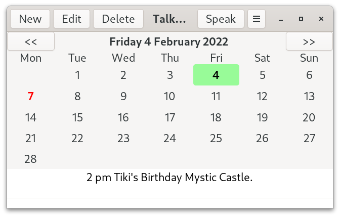
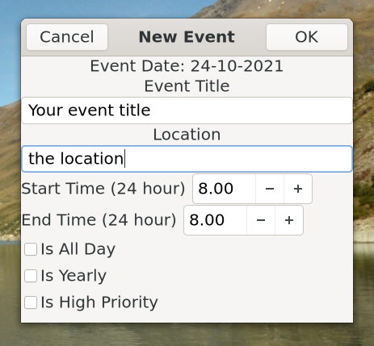
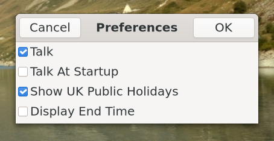
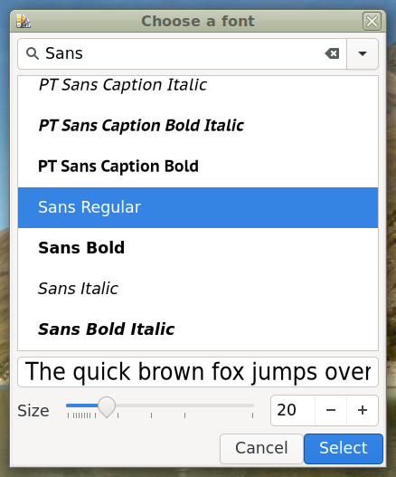
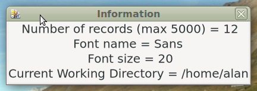
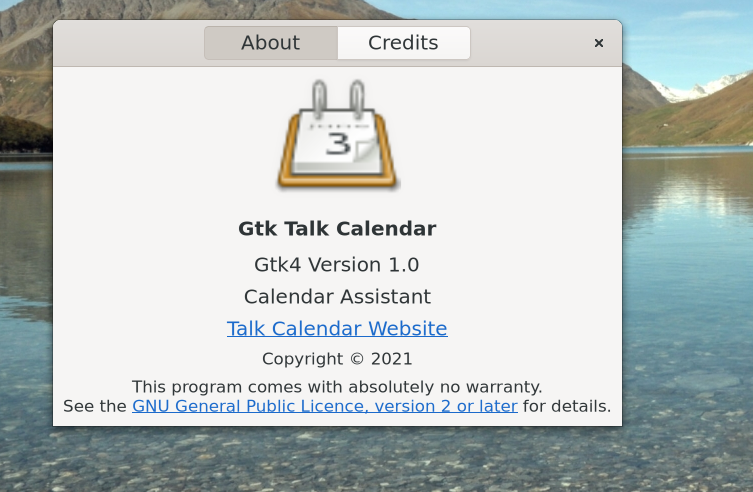
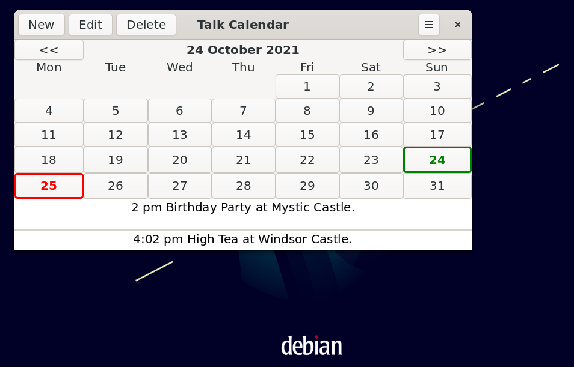

# Talk Calendar (Gtk4 Version)

Talk Calendar is a Linux desktop calendar with some speech capability. 



Talk Calendar is free and open source and built with [Gtk](https://www.gtk.org/). This is the Gtk4 version. It will NOT compile against the Gtk3 libraries as there are many depreciations and other changes as outlined in the migrating from 3 to 4 [article](https://docs.gtk.org/gtk4/migrating-3to4.html). A older gtk3 version of Talk Calendar can be found [here](https://gitlab.com/crispinalan/talkcalendar).

## Deployment

A 64 bit binary package developed and can be downloaded from [bin-packages](https://github.com/crispinalan/talkcalendar/tree/main/bin-packages). This has been tested using Fedora 34 and Debian Bookworm (testing) as these distributions have Gtk4 in their repositories. Alternatively, Talk Calendar can be built from source using the instructions below. 


Assuming Gtk 4 is installed the Talk Calendar binary can be run from the terminal using: 

```
./talkcalendar
```
You need to install the eSpeak speech synthesizer for audio output. 

With Fedora use

```
sudo dnf install espeak
```
With Debian (as superuser) use

```
apt install espeak
```

Check that the Talk Calendar binary has executable permissions. If not use 
```
chmod +x talkcalendar
```

Create a launcher (Mate desktop) to launch Talk Calendar and add Talk Calendar to your start-up programs to read out events when the computer is switched on.

## Usage

### Adding New Event

* Select event date using the calendar.
* Click the New button on the headerbar to invoke the "New Event" dialog.
* Enter the event title, description notes, start and end times etc.
* Events are sorted by start time when displayed.
* A visual marker is placed on a day in the calendar which has an event.
* Navigate through the year using the calendar to add events.



### Editing Existing Event

* Select the event in the list view and click the Edit button on the headerbar to edit.
* Change details as appropriate.

### Preferences

* Use the Preferences section in the hamburger menu to change options. 



* Use the Font dialog to change the application font name and size.



### Help

* Use the Information dialog to display current application preferences.



* Use the About dialog to display current version.



### Keyboard Shortcuts
```
Speak		Spacebar
Today		Home Key
About		<Ctrl>A
Version     <Ctrl>V
Quit		<Ctrl>Q
```

### Talk

* Enable talking in options (use hamburger menu)
* Click on a calendar date with events
* Press the spacebar to speak 

## Debian Testing (Bookworm)

Talk Calendar has been tested with Debian Bookworm (testing) which has gtk4 in the respositories. A screenshot of Talk  Calendar running with Debian is shown below.



You need to install the following packages.

```
apt install build-essential
apt install libgtk-4-dev
apt install gtk-4-examples
apt install espeak
```

The packages:
```
apt install libglib2.0-dev
apt install alsa-utils
```
are needed but should be installed by default


## Build From Source

The gtk4 source code for Talk Calendar is provided in the src directory.

You need the gtk4 development libraries and the gcc compiler. With Fedora you need to install the following packages.

```
sudo dnf install gtk4-devel
sudo dnf install gtk4-devel-docs
sudo dnf install glib-devel
sudo dnf install alsa-lib-devel
sudo dnf install espeak
```

With Debian Bookworm you need to install the following packages

```
apt install build-essential
apt install libgtk-4-dev
apt install gtk-4-examples
apt install espeak
apt install libglib2.0-dev
apt install alsa-utils
```

Compile with

```
gcc $(pkg-config --cflags gtk4) -o talkcalendar main.c $(pkg-config --libs gtk4) -lm

```

I used Geany as the IDE for developing the project as it has an integrated terminal. 


## Versioning

[SemVer](http://semver.org/) is used for versioning. The version number has the form 0.0.0 representing major, minor and bug fix changes. 

## Author

* **Alan Crispin** [Github](https://github.com/crispinalan)


## License

GNU General Public Licence, [Version 3](https://www.gnu.org/licenses/gpl-3.0.en.html). 


## Releases

Talk Calendar Gtk 4 Version 1.0.0
```
built with Gtk4.0
bespoke month calendar which allows days with events to be colour marked
gtk4 new listview used for displaying events
speak at startup option
font change option
flat-file csv database
binary for 64-bit distributions (tested with Fedora 34 Mate and Debian Bookworm Mate)
```

This is the first gtk4 version. Any bugs that arise will be fixed.

The database called events.csv has memory dynamically allocated for up to 5000 records. The database is located in the run directory and can be backed up by copying to another location.

Speech requires espeak to be install independently.

Talk Calendar Gtk 4 Version 1.010
```
built with Gtk4.0
removal of semi-colons from text entry
removal of apostrophes from text entry
binary for 64-bit gtk4 distributions 
```


## Roadmap
```
code refactoring and enhancements 
new features to be added 
natural speech 
package installers (deb, rpm)
```

## Gtk 4.0 Migration Notes

GTK 4 uses [list widgets](https://docs.gtk.org/gtk4/migrating-3to4.html#consider-porting-to-the-new-list-widgets) such as GtkListBox and porting the Gtk 3 version of Talk Calendar has involved replacing the display of events with this a GtkListBox. A significant effort had to be invested into this aspect of the porting. There is an article on scalable lists in gtk4 [here](https://blog.gtk.org/2020/06/07/scalable-lists-in-gtk-4/). Gtk have said [publically](https://www.youtube.com/watch?v=qjF-VotgfeY&t=824s) that it is their intention to eventually replace GtkTreeView and GtkComboBox with [list widgets](https://blog.gtk.org/2020/06/08/more-on-lists-in-gtk-4/). The GtkListBox widget provides a vertical list and can be sorted (in this application events are sorted by start time and then displayed). The application workflow has had to be changed as headerbar buttons are now used to create a new event, edit and delete a selected event in the list. I have used buttons with text labels (New, Edit, Delete) but there is now an option for using Adwaita button icons. 


In Gtk4.0, the function 
```
gtk_window_set_position(GTK_WINDOW(window), GTK_WIN_POS_CENTER);
```
has been depreciated and so has had to be removed from the code. See this [discussion](https://discourse.gnome.org/t/how-to-center-gtkwindows-in-gtk4/3112).

In Gtk 4.0, the function
```
gtk_dialog_run() 
```

has been depreciated. This has been less of an issue as callback functions have been written for the “response” events. See this [discussion](https://discourse.gnome.org/t/how-should-i-replace-a-gtk-dialog-run-in-gtk-4/3501).

I could not place a visual marker on a particular GtkCalendar day using the "gtk_calendar_mark_day()" function. The [GtkInspector](https://wiki.gnome.org/action/show/Projects/GTK/Inspector?action=show&redirect=Projects%2FGTK%2B%2FInspector) debugging tool does not reveal any obvious CSS style theme option that should to be used to do this. Consequently, I have ended up writing a bespoke month calendar which allows days with events to be colour marked. 

The calendar has been developed using the Gtk4 grid layout [manager](https://docs.gtk.org/gtk4/class.Grid.html) which arranges child widgets in rows and columns. In this case the layout manager arranges buttons in a grid. Again a significant effort has had to be invested in this aspect of the porting.

The function "gtk_spin_button_set_text()" has gone. The documented approach for showing spin button [leading zeros](https://people.gnome.org/~ebassi/docs/_build/Gtk/4.0/signal.SpinButton.output.html) doesn't work with gtk4. Consequently, I have had to change the new and edit event dialogs. The spin boxes for the start and end times now accept floating point values which are now stored in the database as floating point values. I have also removed the priority combobox as comboboxes appear to be on the Gtk depreciation hit list (see listview discussion above) and replaced it with a high prirority check button. 

Other depreciations include "gtk_application_set_app_menu()" as discussed [here](https://wiki.gnome.org/HowDoI/ApplicationMenu). The function "gtk_button_set_image()" has gone. In the context of menu development it can be replaced with "gtk_menu_button_set_icon_name()".

The Gtk4 Talk Calendar version uses a new bespoke flat-file csv database with memory dynamically allocated for up to 5000 records. If running Talk Calendar from the terminal the database called "events.csv" is located in the current working directory. Currently, if using a Mate launcher or setting up a main menu item then the database will be located in the home user directory. 


## Acknowledgements

* [Gtk](https://www.gtk.org/)
* GTK is a free and open-source project maintained by GNOME and an active community of contributors. GTK is released under the terms of the [GNU Lesser General Public License version 2.1](https://www.gnu.org/licenses/old-licenses/lgpl-2.1.html).

Gtk4 [manual](https://developer-old.gnome.org/gtk4/stable/).

* [Geany](https://www.geany.org/)
* Geany is a small and lightweight Integrated Development Environment which only requires the GTK+ runtime libraries. It has features including syntax highlighting, code completion, auto completion of often used constructs (e.g. if, for and while), code folding, embedded terminal emulation and extensibility through plugins. Geany uses the GPLv2 license. 

* [eSpeak](http://espeak.sourceforge.net/)
* eSpeak is a software speech synthesizer for English, and some other languages. eSpeak uses a "formant synthesis" method. eSpeak uses the GPLv3 [license](https://www.gnu.org/licenses/gpl-3.0.en.html).


