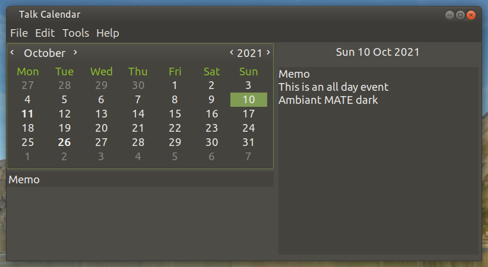
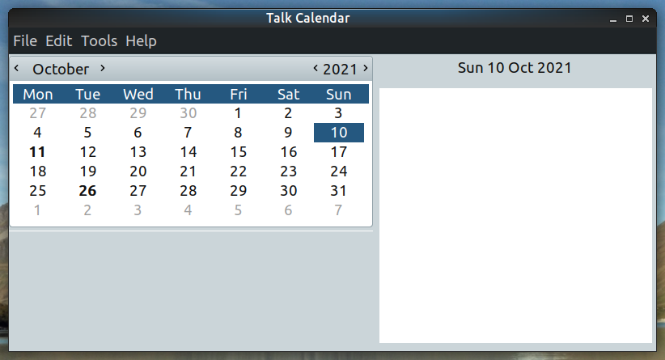
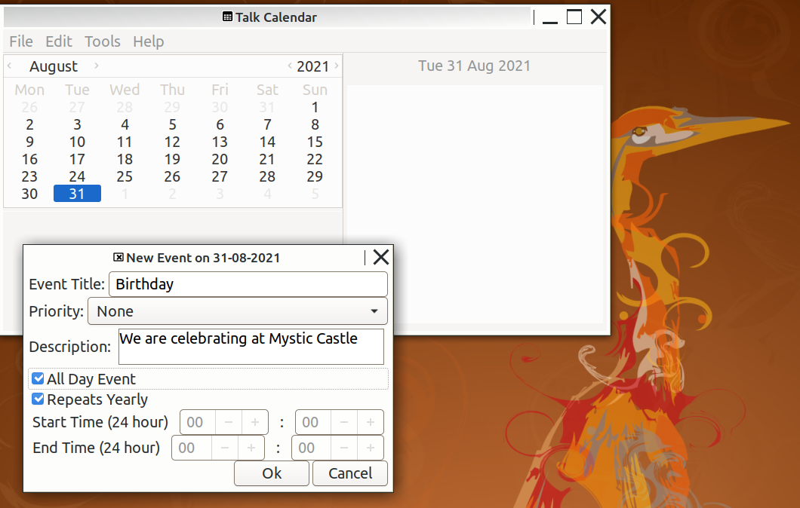

# Talk Calendar

Talk Calendar is a Linux desktop calendar with some speech capability. 


Talk Calendar is free and open source and built with [Gtk](https://www.gtk.org/). It can be run by using the Debian binary  provided.

## Deployment

A binary package for 64-bit Debian based distributions can be downloaded from [bin-packages](https://github.com/crispinalan/talkcalendar/tree/main/bin-packages).  Alternatively, Talk Calendar can be built from source using the instructions below. 

To run Talk Calendar from the terminal use: 

```
./talkcalendar
```
<ins>Note: </ins> If this fails to run check that the Talk Calendar binary has read, write and executable permissions and if necessary change permissions using chmod (e.g. chmod +rwx filename).

For speech the audio word dictionary called <ins>talk </ins> needs to installed in the appropriate directory.

If adding a launcher (Mate desktop) or using a menu editor (Cinnamon desktop) to start up Talk Calendar then in most cases the <ins>talk</ins> dictionary should be located in the home user directory. If uncertain where the dictionary should be located then initially create a desktop launcher with the "Launch in Terminal" or  "Application in Terminal" option selected and then check the dictionary path using the menu option Help->Audio Test which prints to terminal the location path required. See note on dictionary below.

Talk Calendar has been tested using the following 64-bit distributions.
```
Ubuntu Mate (Focal Fossa 20.04.3 LTS)
Debian 11 (Bullseye) Mate Edition
Linux Mint 20.2 Cinnamon Edition  
```

## Usage

### Adding New Event

* Double click on a date in the calendar to invoke the "New Event" dialog.
* Enter the event title, description notes, start and end times, repeat etc.
* Events are sorted by start time when displayed in the side day page view.
* A visual marker is placed on a day in the calendar which has an event.
* Navigate through the year using the calendar to add events.


### Editing Existing Event

* Double click the event in the title list below the calendar to edit.
* Change details as appropriate.

### Preferences

* The options dialog can be accessed from the Edit menu.

### Keyboard Bindings

* key_spacebar = speak
* key_home = return to today (current date)

### Talk

* Enable talking in options 
* Click on a calendar date
* Select Menu->Tools->Talk Selected Date 
* Alternatively press the spacebar to speak 

## Desktop Themes

Desktop theming has been tested using Ubuntu Mate and some screenshot examples  are shown below for the Ambient MATE-DARK, Blue-Submarine and High-Contrast themes.

 



## Build From Source

The Talk Calendar source code is provided in the src directory.

You need the following dependencies:

```
sudo apt install build-essential
sudo apt install libgtk-3-dev
sudo apt install libsqlite3-dev
sudo apt install libasound2-dev
sudo apt install meson
sudo apt install ninja-build
sudo apt install espeak
sudo apt install libttspico-utils
sudo apt install libnotify-dev 
```
The [meson](https://mesonbuild.com/Quick-guide.html) build system is used. At the top level directory the build steps are:
```
meson build  (run once only)
ninja -C build
```
I used Geany as the IDE for developing the project as it has an integrated terminal and other features helpful for coding a Gtk3.0 project (see below). 

The Gtk3.0 reference manual can be viewed locally on a Linux computer using a program called Devhelp. Devhelp is a tool for browsing and searching Gtk API documentation. Having a local copy of the Gtk help documentation is very helpful when developing an application.

```
sudo apt install devhelp
```
## Versioning

[SemVer](http://semver.org/) is used for versioning. The version number has the form 0.0.0 representing major, minor and bug fix changes. 

## Author

* **Alan Crispin** [Github](https://github.com/crispinalan)

## Note on Dictionary

The dictionary supplied is one that I have made for development purposes only. The dictionary consists of pre-recorded words stored as wav files in the relevant directories (e.g. a-words in the a-directory, b-words in the b-directory etc.).

You can create your own audio word dictionary by recording voice words. Currently, the internal audio concatenation algorithm requires words to be recorded using the following format specification
```
Number of channels: 1
Sample rate: 16000
Bits per sample: 16
```

The word dictionary should be located in the current directory if running Talk Calendar from the terminal or the home directory if using a launcher.

## How is speech generated?

Speech is generated using a simple concatenation text-to-speech (TTS) engine which is based on the concatenation of pre-recorded words stored as wav files.  A text scanner reads the title text string and extracts words found in the pre-recorded dictionary of keywords and stores these in a list. The list is then used to concatenate the corresponding sequence of word wav files together to form a single wav file for the selected date. An audio player then plays the concatenated wav file.

With this approach, speech is limited by the number of words found in the dictionary of known words. 

Words for generic event titles are included.  The current list of event title words is:-

agent, allotment, anniversary, annual, appointment, bank, bill, birthday, book, boxing, breakfast, builder, business, calendar, cancel, call, car, category, change, check, Christmas, church, clean, club, code, company, conference, contact, contract, day, dentist, decorate, development, diary, dictionary, dinner, do, doctor, Easter, enable, engagement, estate, event, export, family, fathers, film, friends, funeral, gala, game, garden, gas, general, go, goodbye, goodday, graduation, gym, Halloween, have, hello, high, holiday, hospital, house,  interview, job, lecture, leisure, lift, Linux, lunch, maintenance, meal, medical,  meeting, memo (any other event type), mothers, music,  party, payment, prescription, phone, picnic,  priority,  project, pub, radio, release, religious, reminder, repair, repeat, restaurant, school, seminar, service, shopping, social, software, sport, spring, station, subscription, talk, teacher, team,  theatre, tiki, to, today, train, travel, tutor, tv, university, update, using, valentine, version, visit, walk, wedding, with, work, world, year (plus week days).

Some common single word event title examples from this list would be

```
Anniversary
Birthday
Dentist
Doctor
Event
Film
Funeral
Holiday
Meeting
Memo
Party
Theatre
Travel
Visit
Walk
Wedding
```

Example of combining title words.

```
Car service
Code development
Company meeting
Dentist appointment
Family birthday
Father's day
General Event
Hospital appointment
Mother's day
```

You can have any combination of words from the event title dictionary such as

```
Annual gas service reminder
Bill payment reminder
Book car service appointment
Boxing day family party
Car lift reminder
Go to <word>
```

## License

GNU General Public Licence, version 2 or later. [License](https://www.gnu.org/licenses/old-licenses/gpl-2.0.html).

## License Note

As I am using the Gtk 3.0 GUI toolkit which is licensed using LGPLv2.1 then this license (or the equivalent GPLv2) should be used for the project (like the Geany project). Consequently, the project has been licensed using the same GNU Lesser General Public License version 2 or later to be compatible with Gtk.  The Pico speech synthesizer uses the Apache 2.0 license and this is not compatible with the GPLv2 licenses as discussed in this video [Compatibility in Open Source Licenses](https://www.youtube.com/watch?v=B0aMYeMv-8I). It explains that the Apache 2.0 license is compatible with just about everything except GPLv2 and LGPLv2.1 because it contains certain patent provisions that are inconsistent with these licenses. In fact the SVOX Pico speech synthesizer (libttspico-utils package) is in the Debian non-free archive which is not installed by default.  Debian say "The non-free archive area contains supplemental packages intended to work with the Debian distribution that do not comply with the Debian Free Software Guidelines (DFSG) or have other problems that make their distribution problematic". The eSpeak speech synthesiser is licensed under GPLv3 which is not compatible with GPLv2. When you combine software to produce a larger work  both licenses must be compatible and ideally the same. Consequently the Talk Calendar project is not able to use either the eSpeak or Pico synthesisers. Its uses own internal word concatenation based speech engine which although limited in scope means that there are no potential license compatible issues arising from using an external speech synthesiser.


## Releases

Talk Calendar Version 1.1.1
```
built with Gtk3.0
uses own internal word concatenation speech synthesiser
sqlite used to store events locally
speaks date, event title keywords and priority 
options to change speak preferences
speak at startup option
keyboard bindings key_spacebar (speak) and key_home (today)
export events as csv file
import events from csv file
meson build system
binary for 64-bit Debian based distributions
```

## Roadmap
```
add reminder notifications
improve audio concatenation
improve speech synthesis
improve calendar interface
deb package installer
migrate to using Gtk4 (longer term goal)
```

## Acknowledgements

* [Gtk](https://www.gtk.org/)
* GTK is a free and open-source project maintained by GNOME and an active community of contributors. GTK is released under the terms of the [GNU Lesser General Public License version 2.1](https://www.gnu.org/licenses/old-licenses/lgpl-2.1.html).

* [Geany](https://www.geany.org/)
* Geany is a small and lightweight Integrated Development Environment which only requires the GTK+ runtime libraries. With most Linux distrbutions Geany can be installed via the package manager. Alternatively it can be installed from source using the autotools based build system [Geany autotools build](https://www.geany.org/manual/current/#source-compilation). 
* It has features including syntax highlighting, code completion, auto completion of often used constructs (e.g. if, for and while), code folding, embedded terminal emulation and extensibility through plugins. The Geany IDE uses "tags" files for its autocompletion [tags](https://wiki.geany.org/tags/start). With Linux, these tag files (e.g. the gtk tag file) are copied to the config directory (./config/geany/tags/) to enable code completion. Geany uses the GPLv2 license. 

* [Sqlite](https://www.sqlite.org/index.html)
* SQLite is an in-process library that implements a self-contained, serverless, zero-configuration, transactional SQL database engine. SQLite.org say that: "SQLite is in the public domain and does not require a [license](https://www.sqlite.org/copyright.html)".

* [Alsa](https://www.alsa-project.org/wiki/Main_Page) 
* The Advanced Linux Sound Architecture (ALSA) provides audio and MIDI functionality to the Linux operating system. ALSA is  released under GPL-2.0-or-later and LGPL-2.1-or-later.  ALSA driver code is included in the  Linux kernel since 2.6.


