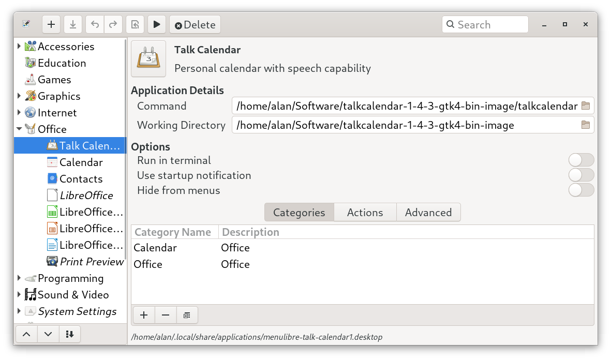
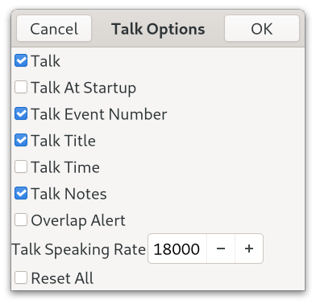

# Talk Calendar (Gtk4 Version)

## Preamble

Talk Calendar is a Linux personal desktop calendar with some speech capability. With this solo version the dependency on an external text-to-speech engine has been removed and replaced with a basic built-in self contained speech synthesizer. This means that Talk Calendar can be run as a standalone application. This is the Gtk4 version of Talk Calendar and it will not compile against the Gtk3 libraries as there are many depreciations and other changes as outlined in the Gtk's migrating from 3 to 4 [article](https://docs.gtk.org/gtk4/migrating-3to4.html). My migration notes below outline the code changes that I had to make to use Gtk4.


 
## Deployment

### Binary Image

A 64 bit binary image is available and can be downloaded from [bin-packages](https://github.com/crispinalan/talkcalendar/tree/main/bin-packages) and can be used with Linux distributions that have Gtk4 in their repositories such as Fedora 35, Debian Bookworm (in testing) and Ubuntu 21.10* etc. 

Assuming that the Gtk4 base libraries are installed the Talk Calendar binary can be run from the terminal using: 

```
./talkcalendar
```

or double click on the talkcalendar file. Make sure it has executable permissions. Right click on it, then select permissions and ensure "Allow executing file as program" is selected. Audio output requires that the alsa-utils package is installed (this is usually installed by default).

Use a menu editor such as [MenuLibre](https://github.com/bluesabre/menulibre) to create a launcher for Talk Calendar. MenuLibre allows the working directory to be set as shown below. 



The database called "eventsdb.csv" is located in the working directory. With Talk Calendar you can use the following menu item
 
```
Help->Information
```
to show the current working directory where the events database should be located,

Using the binary image together with a menu editor is a universal approach for getting Talk Calendar installed on most Gtk4 distros.

### Working Directory 

Make sure that the **phoneme** wav file directory (this stores the phoneme sound files of short duration) is located in the working directory. The phoneme directory can be found by downloading the binary image. If you do not set the a working directory it will most likely be your home directory. The database called "eventsdb.csv" will be located in the working directory.

### Ubuntu* 

With Ubuntu 21.10 the base Gtk4 libraries can be installed using
```
sudo apt install libgtk-4-1
```

Alternatively, Talk Calendar can be built from source using the code in this repository. See notes below which explain how to do this.

## Talk Calendar Usage

### Adding New Event

* Select event date using the calendar.
* Click the New button on the headerbar to invoke the "New Event" dialog.
* Enter the event title.
* Enter the location.
* Enter "Speak" word or words such as "Birthday Party" for the event type
* Enter start and end times. 
* Events are sorted by start time when displayed.
* A colour marker is placed on a day in the calendar which has an event.
* Navigate through the year using the calendar to add events.


## Speech Words For Events 

Talk Calendar has a small built-in dictionary of words which can be converted into speech for reading out the event type. The built-in speech synthesis is used to create a spoken version of the text. The current list of dictionary speech words is:


| Letter        | Dictionary Words  |
| ------------- | ------------- |
| A words:      | activity, agenda, alert, allotment, airport, and, anniversary, appointment |
| B words:      | bank, banquet, barbershop, bill, birthday, book, builder, buns|
| C words:      | cancelled, cake, car, calendar, castle, celebrate, celebration, charity, christmas, code, cooking, contact, cricket, critical, cycle |
| D words:      | day, delivery, dentist, development, doctor |
| E words:      | easter, energy, estate,  event |
| F words:      | family, father, fathers, film, food, football, friend, funeral |
| G words:      | garden, gas, go, good |
| H words:      | hairdresser, health, heating, hello, high, house, holiday, home, hospital|
| I words:      | insurance, interview|
| L words:      | letter, leisure, lift, linux, low, lunch|
| M words:      | match, meal, medical, meeting, memo, mince, milkman, mother, mothers, move, movie, music |
| N words:      | netflix |
| O words:      | online, operation |
| P words:      | parcel, party, pay, payment, pension, personal, phone, picnic, pies, post, priority, project |
| R words:      | radio, red, remember, reminder, repair, restaurant |
| S words:      | seed, service, shop, shopping, show, solicitor, sowing, supermarket,  special, sport, station, subscription, system|
| T words:      | tax, talk, tea, theatre, to, train, training, travel, television |
| U words:      | update|
| V words:      | vacation, valentine, valentines, vehicle, visit |
| W words:      | walk, wedding, wind, work, world |


You can have a combination of words from the dictionary such as
```
birthday party
payment reminder
train station
house event
family visit
car tax payment
```

### Editing Existing Event

* Select the event in the list view and click the Edit button on the headerbar to edit.
* Change details as appropriate.

### Calendar Options

* Use the Calendar Options dialog in the hamburger menu to change calendar options 


You can show public holidays on the calendar and event end-times in the list view. You can change the colours and borders of the current day (today), event days and public holidays. Days with high priority events can have a separate colour.

### Talk Options

* Use the Talk Options dialog in the hamburger menu to change talk options



Adjust the talk speaking rate to alter the delivery of the speech for best results.

### Talk

* Enable talking in Talk Options
* Enable "Talk At Startup" in Talk Options to read out the date and event details for the current day when the calendar is started
* Click on a calendar date with events
* Press the spacebar to speak or use the speak menu item  to read out selected event details.

### Help

* Use the Information dialog to display current application preferences including the current working directory in which the eventsdb.csv file is stored


* Use the About dialog to display current version.


### Keyboard Shortcuts
```
Speak		Spacebar
Today		Home Key
```

## Startup Applications

Add Talk Calendar to your start-up programs to read out events when the computer is switched on.

With the GNOME desktop use the GNOME "Tweak Tool" to add Talk Calendar to your startup applications.


## Build From Source

The C source code for Talk Calendar is provided in the src directory.

You need the Gtk4 development libraries and the gcc compiler. 

With Fedora you need to install the following packages.

```
sudo dnf install gtk4-devel
sudo dnf install gtk4-devel-docs
sudo dnf install glib-devel
sudo dnf install alsa-lib-devel
```

With Debian Bookworm (and Ubuntu) you need to install the following packages

```
apt install build-essential
apt install libgtk-4-dev
apt install gtk-4-examples
apt install libglib2.0-dev
apt install alsa-utils
```
The packages:
```
apt install libglib2.0-dev
apt install alsa-utils
```
are needed but should be installed by default


I used Geany as the IDE for developing the project as it has an integrated terminal. 

Use the MAKEFILE to compile.

### Font Note

With GNOME you change the desktop 'font-name' and 'document-font-name' using gsettings.

Cantarell is the default font supplied with GNOME since version 3.0. Fedora ships with 'Cantarell 11' as the default font. This can be checked using the following commands.

```
gsettings get org.gnome.desktop.interface font-name 
gsettings get org.gnome.desktop.interface document-font-name
```
Talk Calendar uses the default GNOME desktop font-name.

To change the desktop font to say 'Sans 11' you would use the following commands.
```
gsettings set org.gnome.desktop.interface document-font-name 'Sans 11'
gsettings set org.gnome.desktop.interface font-name 'Sans 11'
```

Talk Calendar allows the calendar font size to be changed using the Preferences Dialog. The actual size of the calendar font depends on the GNOME text scaling factor which can found using the following command.

```
gsettings get org.gnome.desktop.interface text-scaling-factor
```
For a larger font size, the text-scaling factor is typically set to 1.3 using the following command.
```
gsettings set org.gnome.desktop.interface text-scaling-factor 1.3
```

To reset the text scaling factor use.
```
gsettings reset org.gnome.desktop.interface text-scaling-factor
```

The current system desktop font, the GNOME text scaling factor and the Talk Calendar font size chosen by the user are shown in the information panel in the Help menu section.


## Wayland

Talk Calendar is being developed and tested using Fedora 35 GNOME using the Wayland display compositor and so far no problems have been detected with Wayland.


## Core Features

* built with Gtk4.0
* event title, location, type, start and end time can be entered and edited
* bespoke month calendar which allows days with events to be colour marked
* priority events can be separately colour marked
* internal speech synthesizer
* bespoke flat-file csv database with memory dynamically allocated for up to 5000 records
* binary for 64-bit Gtk4 distributions 

### How is speech generated?

Speech is generated using a simple phoneme based speech synthesizer. Words are formed as sequences of elementary speech units known as phonemes. Word to phoneme mapping is carried out using a dictionary based approach. This involves translating words into phoneme text notation. Synthesized speech is then created by concatenating pre-recorded phonemes stored as wav files using the text-to-phoneme description.

The open source online [cmudict](http://www.speech.cs.cmu.edu/cgi-bin/cmudict) has been used to look up the phoneme pronunciation for the dictionary words. 

## History

This is a hobby project under development. 

C++ and Qt were used to develop the original calendar project but when the Qt Company announced that the Qt LTS versions and the offline installer were to become commercial-only [Qt licensing changes](https://www.qt.io/blog/qt-offering-changes-2020) I decided to look for an alternative GUI toolkit. I found a good open source alternative to Qt called [CopperSpice](https://www.copperspice.com/). CopperSpice was derived from Qt 4.8 and is under the LGPL 2.1 license. It was considered but unfortuantely it is not widely available in Linux distribution repositories. For more details on the Qt license situation see the article entitled [The Qt Company Is Tomorrow Moving Qt 5.15 To Its Commercial-Only LTS Phase](https://www.phoronix.com/scan.php?page=news_item&px=Qt-5.15-LTS-Commercial-Phase). 


I decided to completely re-write the project code from scratch using the open source [Gtk](https://www.gtk.org/) toolkit as it is widely available in most Linux distribution repositories. It seemed to be very unlikely that the Gtk toolkit would change its license to become commercial-only. Moving from Qt to Gtk was a steep learning curve. 

The first iteration of the Talk Calendar project used Gtk3 but then migrated to the newer Gtk4 toolkit. See my migration notes below which may help if your are migrating a Gtk3 project to Gtk4. The Gtk4 Talk Calendar version uses a new bespoke flat-file csv database (rather than sqlite) with memory dynamically allocated for up to 5000 records. The database called "eventsdb.csv" should be located in the current working directory. 

The latest version of Talk Calendar has a built-in phoneme systhesizer for speech so that it can be used as a standalone application without the need for an external text-to-speech engine. The internal speech synthesizer definitely needs more work and is not great but it is functional. Adjust the talk speaking rate for best results.


## Gtk 4.0 Migration Notes

GTK 4 uses [list widgets](https://docs.gtk.org/gtk4/migrating-3to4.html#consider-porting-to-the-new-list-widgets) such as GtkListBox and porting the Gtk 3 version of Talk Calendar has involved replacing the display of events with a GtkListBox. A significant effort had to be invested into this aspect of the porting. There is an article on scalable lists in gtk4 [here](https://blog.gtk.org/2020/06/07/scalable-lists-in-gtk-4/). Gtk have said [publically](https://www.youtube.com/watch?v=qjF-VotgfeY&t=824s) that it is their intention to eventually replace GtkTreeView and GtkComboBox with [list widgets](https://blog.gtk.org/2020/06/08/more-on-lists-in-gtk-4/). The GtkListBox widget provides a vertical list and can be sorted (in this application events are sorted by start time and then displayed). The application workflow has had to be changed as headerbar buttons are now used to create a new event, edit and delete a selected event in the list. I have used buttons with text labels (New, Edit, Delete) but there is now an option for using Adwaita button icons. 

In Gtk4.0, the function 
```
gtk_window_set_position(GTK_WINDOW(window), GTK_WIN_POS_CENTER);
```
has been depreciated and so has had to be removed from the code. See this [discussion](https://discourse.gnome.org/t/how-to-center-gtkwindows-in-gtk4/3112).

In Gtk 4.0, the function
```
gtk_dialog_run() 
```

has been depreciated. This has been less of an issue as callback functions have been written for the “response” events. See this [discussion](https://discourse.gnome.org/t/how-should-i-replace-a-gtk-dialog-run-in-gtk-4/3501).

I could not place a visual marker on a particular GtkCalendar day using the "gtk_calendar_mark_day()" function. The [GtkInspector](https://wiki.gnome.org/action/show/Projects/GTK/Inspector?action=show&redirect=Projects%2FGTK%2B%2FInspector) debugging tool does not reveal any obvious CSS style theme option that should to be used to do this. Consequently, I have ended up writing a bespoke month calendar which allows days with events to be colour marked. 

The calendar has been developed using the Gtk4 grid layout [manager](https://docs.gtk.org/gtk4/class.Grid.html) which arranges child widgets in rows and columns. In this case the layout manager arranges buttons in a grid. Again a significant effort has had to be invested in this aspect of the porting.

The function "gtk_spin_button_set_text()" has gone. The documented approach for showing spin button [leading zeros](https://people.gnome.org/~ebassi/docs/_build/Gtk/4.0/signal.SpinButton.output.html) doesn't work with gtk4. Consequently, I have had to change the new and edit event dialogs. The spin boxes for the start and end times now accept floating point values which are now stored in the database as floating point values. I have also removed the priority combobox as comboboxes appear to be on the Gtk depreciation hit list (see list widget discussion above) and replaced it with a high prirority check button. 

Other depreciations include "gtk_application_set_app_menu()" as discussed [here](https://wiki.gnome.org/HowDoI/ApplicationMenu). The function "gtk_button_set_image()" has gone. In the context of menu development it can be replaced with "gtk_menu_button_set_icon_name()".


## Roadmap
```
improve word pronunciation 
explore the use of stress to improve tone of voice
control of pitch, speed, word gap settings
increase number of words in pronouncing dictionary
improve dictionary mapping
code refactoring and enhancements
upcoming events alert
```

## Versioning

[SemVer](http://semver.org/) is used for versioning. The version number has the form 0.0.0 representing major, minor and bug fix changes. 

## Author

* **Alan Crispin** [Github](https://github.com/crispinalan)

 
## License

GNU General Public Licence, Version 3. 

## License Note

The Gtk4.0 GUI toolkit is licensed using LGPLv2.1.  Consequently, Talk Calendar has been licensed using the GNU  General Public License.


## Acknowledgements

* [Gtk](https://www.gtk.org/)
* GTK is a free and open-source project maintained by GNOME and an active community of contributors. GTK is released under the terms of the [GNU Lesser General Public License version 2.1](https://www.gnu.org/licenses/old-licenses/lgpl-2.1.html).
* Gtk4 [manual](https://developer-old.gnome.org/gtk4/stable/).

* [Geany](https://www.geany.org/)
* Geany is a small and lightweight Integrated Development Environment which only requires the GTK+ runtime libraries. It has features including syntax highlighting, code completion, auto completion of often used constructs (e.g. if, for and while), code folding, embedded terminal emulation and extensibility through plugins. Geany uses the GPLv2 license.

* [cmudict](http://www.speech.cs.cmu.edu/cgi-bin/cmudict) can be used to look up the phoneme pronunciation for a word or phrase in CMUdict. The CMU Pronouncing Dictionary is an open-source pronouncing dictionary originally created by the Speech Group at Carnegie Mellon University for use in speech recognition research. License: BSD. 


