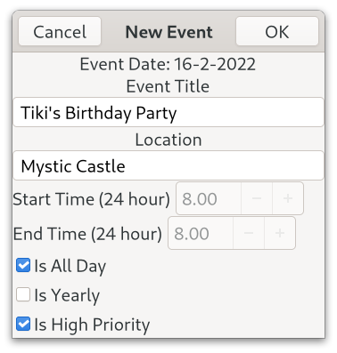

# Talk Calendar (Gtk4 Version)

Talk Calendar is a Linux desktop calendar with speech capability. 


Talk Calendar is free and open source and built with [Gtk](https://www.gtk.org/). This is the Gtk4 version which replaces the older Gtk3 version. It will **NOT** compile against the Gtk3 libraries as there are many depreciations and other changes as outlined in the migrating from 3 to 4 [article](https://docs.gtk.org/gtk4/migrating-3to4.html). My migration notes below outline the code changes that had to made to use Gtk4.

## Deployment

### Binary Image

A 64 bit binary image is available and can be downloaded from [bin-packages](https://github.com/crispinalan/talkcalendar/tree/main/bin-packages) and can be used with Linux distributions that have Gtk4 in their repositories such as Fedora 35, Debian Bookworm (in testing) and Ubuntu 21.10* etc. 

Assuming that the Gtk4 base libraries are installed the Talk Calendar binary can be run from the terminal using: 

```
./talkcalendar
```

Use a menu editor such as [MenuLibre](https://github.com/bluesabre/menulibre) to create a launcher for Talk Calendar. MenuLibre allows the working directory to be set as shown below.


Using the binary image with a menu editor is a universal approach for getting Talk Calendar installed on most Gtk4 distros.

*With Ubuntu 21.10 the base Gtk4 libraries can be installed using
```
sudo apt install libgtk-4-1
```
Alternatively, Talk Calendar can be built from source using the code in this repository. See notes below which explain how to do this.

### Working Directory 

Make sure that the Flite speech engine file is located in working directory. If you do not set the a working directory it will most likely default to your home directory. The database called "events.csv" and the speech engine (the flite executable) should be located in the working directory.

With Talk Calendar you can use the following menu item
 
```
Help->Information
```
to show the current working directory where both the speech engine and the events database should be located.

## Talk Calendar Usage

### Adding New Event

* Select event date using the calendar.
* Click the New button on the headerbar to invoke the "New Event" dialog.
* Enter the event title, location, start and end times.
* Events are sorted by start time when displayed.
* A visual marker is placed on a day in the calendar which has an event.
* Navigate through the year using the calendar to add events.



### Editing Existing Event

* Select the event in the list view and click the Edit button on the headerbar to edit.
* Change details as appropriate.

### Preferences

* Use the Preferences section in the hamburger menu to change options. 


### Font

With GNOME you change the desktop 'font-name' and 'document-font-name' using gsettings.

Cantarell is the default font supplied with GNOME since version 3.0. Fedora ships with 'Cantarell 11' as the default font. This can be checked using the following commands.

```
gsettings get org.gnome.desktop.interface font-name 
gsettings get org.gnome.desktop.interface document-font-name
```
Talk Calendar uses the default GNOME desktop font-name.

To change the desktop font to say 'Sans 11' you would use the following commands.
```
gsettings set org.gnome.desktop.interface document-font-name 'Sans 11'
gsettings set org.gnome.desktop.interface font-name 'Sans 11'
```

Talk Calendar allows the calendar font size to be changed using the Preferences Dialog. The actual size of the calendar font depends on the GNOME text scaling factor which can found using the following command.

```
gsettings get org.gnome.desktop.interface text-scaling-factor
```
For a larger font size, the text-scaling factor is typically set to 1.3 using the following command.
```
gsettings set org.gnome.desktop.interface text-scaling-factor 1.3
```

To reset the text scaling factor use.
```
gsettings reset org.gnome.desktop.interface text-scaling-factor
```

The current system desktop font, the GNOME text scaling factor and the Talk Calendar font size chosen by the user are shown in the information panel in the Help menu section.


### Help

* Use the Information dialog to display current application preferences.


* Use the About dialog to display current version.


### Keyboard Shortcuts
```
Speak		Spacebar
Today		Home Key
About		<Ctrl>A
Version		<Ctrl>V
Quit		<Ctrl>Q
```

### Talk

* Enable talking in options (use hamburger menu)
* Click on a calendar date with events
* Press the spacebar to speak or click the speak button 

## Startup Applications

Add Talk Calendar to your start-up programs to read out events when the computer is switched on.

With the Gnome desktop use the Gnome "Tweak Tool" to add Talk Calendar to your startup applications.


## Build From Source

The Gtk4 source code for Talk Calendar is provided in the src directory.

You need the Gtk4 development libraries and the gcc compiler. 

With Debian Bookworm you need to install the following packages

```
apt install build-essential
apt install libgtk-4-dev
apt install gtk-4-examples
apt install libglib2.0-dev
apt install alsa-utils
```
The packages:
```
apt install libglib2.0-dev
apt install alsa-utils
```
are needed but should be installed by default

With Fedora you need to install the following packages.

```
sudo dnf install gtk4-devel
sudo dnf install gtk4-devel-docs
sudo dnf install glib-devel
sudo dnf install alsa-lib-devel
```

I used Geany as the IDE for developing the project as it has an integrated terminal. 

Compile with

```
gcc $(pkg-config --cflags gtk4) -o talkcalendar main.c $(pkg-config --libs gtk4) -lm
```
### Compiling Flite

Different distributions are using different versions of the Flite speech synthesiser (e.g. Fedora 34 is using version 1.3, while Debian Bullseye is using version 2.2). Consequently, the latest version 2.2 has been compiled from source and is used locally by Talk Calendar. 

To compile Flite you should use the latest C source code which can can be downloaded from [github](https://github.com/festvox/flite). The compiled executable should be located in the Talk Calendar working directory. Binary packages of both the latest version of Talk Calendar and Flite can be downloaded from [bin-packages](https://github.com/crispinalan/talkcalendar/tree/main/bin-packages). 


## Releases

Talk Calendar Gtk 4 Version 1.0.0
```
built with Gtk4.0
bespoke month calendar which allows days with events to be colour marked
gtk4 new listview used for displaying events
speak at startup option
font change option
flat-file csv database
binary for 64-bit distributions (tested with Fedora 34 Mate and Debian Bookworm Mate)
```

The database called events.csv has memory dynamically allocated for up to 5000 records. The database is located in the Talk Calendar working directory and can be backed up by copying to another location.


Talk Calendar Gtk 4 Version 1.0.1
```
built with Gtk4.0
removal of semi-colons from text entry to prevent a database error
removal of apostrophes from text entry
binary for 64-bit gtk4 distributions 
```
Talk Calendar Gtk 4 Version 1.0.2
```
built with Gtk4.0
local build of Flite version 2.2 used for speech synthesis 
option to use adwaita button icons
binary for 64-bit gtk4 distributions
```

Talk Calendar Gtk 4 Version 1.1.0

```
built with Gtk4.0
local build of Flite version 2.2 used for speech synthesis 
startup notification option
font size code refactoring
binary for 64-bit gtk4 distributions
```
Talk Calendar Gtk 4 Version 1.1.1

```
built with Gtk4.0
colour changes
fixed removal of apostrophes from text entry
binary for 64-bit gtk4 distributions
deb package installer
```
Talk Calendar Gtk 4 Version 1.1.2
```
colour changes
next month button goes to first of next month
previous month button goes to first of previous month
```

## Wayland

Talk Calendar has been tested with Fedora 35 GNOME using the Wayland display compositor. 


## Roadmap
```
calendar colour and grid options
code refactoring and enhancements 
new features 
deployment binary image
```

## Gtk 4.0 Migration Notes

GTK 4 uses [list widgets](https://docs.gtk.org/gtk4/migrating-3to4.html#consider-porting-to-the-new-list-widgets) such as GtkListBox and porting the Gtk 3 version of Talk Calendar has involved replacing the display of events with a GtkListBox. A significant effort had to be invested into this aspect of the porting. There is an article on scalable lists in gtk4 [here](https://blog.gtk.org/2020/06/07/scalable-lists-in-gtk-4/). Gtk have said [publically](https://www.youtube.com/watch?v=qjF-VotgfeY&t=824s) that it is their intention to eventually replace GtkTreeView and GtkComboBox with [list widgets](https://blog.gtk.org/2020/06/08/more-on-lists-in-gtk-4/). The GtkListBox widget provides a vertical list and can be sorted (in this application events are sorted by start time and then displayed). The application workflow has had to be changed as headerbar buttons are now used to create a new event, edit and delete a selected event in the list. I have used buttons with text labels (New, Edit, Delete) but there is now an option for using Adwaita button icons. 


In Gtk4.0, the function 
```
gtk_window_set_position(GTK_WINDOW(window), GTK_WIN_POS_CENTER);
```
has been depreciated and so has had to be removed from the code. See this [discussion](https://discourse.gnome.org/t/how-to-center-gtkwindows-in-gtk4/3112).

In Gtk 4.0, the function
```
gtk_dialog_run() 
```

has been depreciated. This has been less of an issue as callback functions have been written for the “response” events. See this [discussion](https://discourse.gnome.org/t/how-should-i-replace-a-gtk-dialog-run-in-gtk-4/3501).

I could not place a visual marker on a particular GtkCalendar day using the "gtk_calendar_mark_day()" function. The [GtkInspector](https://wiki.gnome.org/action/show/Projects/GTK/Inspector?action=show&redirect=Projects%2FGTK%2B%2FInspector) debugging tool does not reveal any obvious CSS style theme option that should to be used to do this. Consequently, I have ended up writing a bespoke month calendar which allows days with events to be colour marked. 

The calendar has been developed using the Gtk4 grid layout [manager](https://docs.gtk.org/gtk4/class.Grid.html) which arranges child widgets in rows and columns. In this case the layout manager arranges buttons in a grid. Again a significant effort has had to be invested in this aspect of the porting.

The function "gtk_spin_button_set_text()" has gone. The documented approach for showing spin button [leading zeros](https://people.gnome.org/~ebassi/docs/_build/Gtk/4.0/signal.SpinButton.output.html) doesn't work with gtk4. Consequently, I have had to change the new and edit event dialogs. The spin boxes for the start and end times now accept floating point values which are now stored in the database as floating point values. I have also removed the priority combobox as comboboxes appear to be on the Gtk depreciation hit list (see list widget discussion above) and replaced it with a high prirority check button. 

Other depreciations include "gtk_application_set_app_menu()" as discussed [here](https://wiki.gnome.org/HowDoI/ApplicationMenu). The function "gtk_button_set_image()" has gone. In the context of menu development it can be replaced with "gtk_menu_button_set_icon_name()".

The Gtk4 Talk Calendar version uses a new bespoke flat-file csv database with memory dynamically allocated for up to 5000 records. The database called "events.csv" should be located in the current working directory. 

## Deployment Notes

Deployment is via a binary image and use of a menu editor for Gtk4 distributions (Debian Bookworm, Fedora 35, Ubuntu 21.10 etc.) which allows Talk Calendar to be run from the user home directory. This is a universal approach rather than developing separate packages for each Linux distribution i.e. deb package for Debian distributions, a snap package for Ubuntu distributions and a rpm package for Fedora distributions etc. A compilation-from-source installation can be done using the code in the source directory.

## Versioning

[SemVer](http://semver.org/) is used for versioning. The version number has the form 0.0.0 representing major, minor and bug fix changes. 

## Author

* **Alan Crispin** [Github](https://github.com/crispinalan)

 
## License

GNU General Public Licence, version 2 or later (GPLv2+). 

## License Note

The Gtk4.0 GUI toolkit is licensed using LGPLv2.1.  Consequently, Talk Calendar has been licensed using the GNU Lesser General Public License version 2 or later to be compatible with Gtk.

When you combine software to produce a larger work both licenses should be compatible. This is relevant with regard to combining this software with an external speech synthesiser.  Open source licenses and their compatibility is disussed in this [article](https://janelia-flyem.github.io/licenses.html) and [here](https://www.gnu.org/licenses/gpl-faq.en.html).

The Flite (Festival Lite) speech sythesiser has a BSD-like [license](https://github.com/festvox/flite/blob/master/COPYING). The BSD license is compatible with just about everything [Compatibility in Open Source Licenses](https://www.youtube.com/watch?v=B0aMYeMv-8I). Flite is an official Debian package and labeled [DFGS free](https://blends.debian.org/accessibility/tasks/speechsynthesis) and so it is used with Talk Calendar.

## Acknowledgements

* [Gtk](https://www.gtk.org/)
* GTK is a free and open-source project maintained by GNOME and an active community of contributors. GTK is released under the terms of the [GNU Lesser General Public License version 2.1](https://www.gnu.org/licenses/old-licenses/lgpl-2.1.html).
* Gtk4 [manual](https://developer-old.gnome.org/gtk4/stable/).

* [Geany](https://www.geany.org/)
* Geany is a small and lightweight Integrated Development Environment which only requires the GTK+ runtime libraries. It has features including syntax highlighting, code completion, auto completion of often used constructs (e.g. if, for and while), code folding, embedded terminal emulation and extensibility through plugins. Geany uses the GPLv2 license. 

* [Flite](http://www.festvox.org/flite/)
* Flite (festival-lite) is a small fast portable speech synthesis system. The core Flite library was originally developed by Alan W Black and the history of the project together with other contributors can be found [here](https://github.com/festvox/flite). Flite is free software and the core code has a BSD-like [license](https://github.com/festvox/flite/blob/master/COPYING). It is an official Debian package and labeled [DFGS free](https://blends.debian.org/accessibility/tasks/speechsynthesis). Because different distributions are using different versions of Flite the latest version 2.2 has been compiled from source and is used locally by Talk Calendar. Should you wish to do this for yourself the latest C source code can be downloaded from [github](https://github.com/festvox/flite). 

