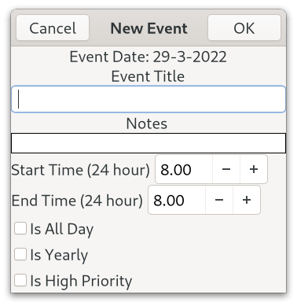

# Talk Calendar

Talk Calendar is a Linux desktop calendar with speech capability. 


Talk Calendar is free and open source and built with [Gtk](https://www.gtk.org/). 

## Deployment

A binary package for 64-bit Debian based distributions can be downloaded from [bin-packages](https://github.com/crispinalan/talkcalendar/tree/main/bin-packages).  Alternatively, Talk Calendar can be built from source using the instructions below. 

You need to install a speech synthesizer. Both eSpeak and Pico TTS are supported and can be installed on a Ubuntu distribution using the commands below.

```
sudo apt install espeak
sudo apt install libttspico-utils
```
<ins>Note: </ins>  The `libttspico-utils` package is available on [Debian Bullseye]( 
https://packages.debian.org/bullseye/libttspico-utils)


To run Talk Calendar from the terminal use: 

```
./talkcalendar
```

<ins>Note: </ins> If this fails to run check that the Talk Calendar binary has read, write and executable permissions and if necessary change permissions using chmod (e.g. chmod +rwx filename).

You can add a launcher (Mate desktop) or use the  menu editor (Cinnamon desktop) to open and run Talk Calendar. If you add Talk Calendar to your start-up applications you can read out day events when the computer is switched on.

To check that audio is working (with talk enabled in the options) use the Talk Calendar menu option 
```
Help->Audio_Test 
```
which reads out the current version.

Talk Calendar has been tested using the following 64-bit distributions.
```
Ubuntu Mate (Focal Fossa 20.04.3 LTS)
Debian 11 (Bullseye) Mate Edition
Linux Mint 20.2 Cinnamon Edition  
```

## Usage

### Adding New Event

* Double click on a date in the calendar to invoke the "New Event" dialog.
* Enter the event title, description notes, start and end times, repeat etc.
* Events are sorted by start time when displayed in the side day page view.
* A visual marker is placed on a day in the calendar which has an event.
* Navigate through the year using the calendar to add events.



### Editing Existing Event

* Double click the event in the title list below the calendar to edit.
* Change details as appropriate.

### Preferences

* The options dialog can be accessed from the Edit menu.


### Keyboard Bindings

* key_spacebar = speak
* key_home = return to today (current date)

### Talk

* Enable talking in options 
* Click on a calendar date
* Select Menu->Tools->Talk Selected Date 
* Alternatively press the spacebar to speak 

## Desktop Themes

Desktop theming has been tested using Ubuntu Mate and some screenshot examples  are shown below for the Ambiant MATE-DARK, Blue-Submarine and High-Contrast themes.

 


## Build From Source

The Talk Calendar source code is provided in the src directory.

You need the following dependencies:

```
sudo apt install build-essential
sudo apt install libgtk-3-dev
sudo apt install libsqlite3-dev
sudo apt install libasound2-dev
sudo apt install meson
sudo apt install ninja-build
sudo apt install espeak
sudo apt install libttspico-utils
```
The [meson](https://mesonbuild.com/Quick-guide.html) build system is used. At the top level directory the build steps are:
```
meson build  (run once only)
ninja -C build
```
I used Geany as the IDE for developing the project as it has an integrated terminal and other features helpful for coding a Gtk3.0 project (see below). 

The Gtk3.0 reference manual can be viewed locally on a Linux computer using a program called Devhelp. Devhelp is a tool for browsing and searching Gtk API documentation. Having a local copy of the Gtk help documentation is very helpful when developing an application.

```
sudo apt install devhelp
```
## Versioning

[SemVer](http://semver.org/) is used for versioning. The version number has the form 0.0.0 representing major, minor and bug fix changes. 

## Author

* **Alan Crispin** [Github](https://github.com/crispinalan)


## License

This software is licensed under version 3 of the GNU General Public License.

## License Note

The eSpeak speech synthesiser is licensed under GPLv3 and the Pico TTS library under the Apache License 2.0. The Apache License 2.0 is compatible with GPLv3 as discussed in the [Top 10 Apache License Questions Answered ](https://www.whitesourcesoftware.com/resources/blog/top-10-apache-license-questions-answered/#5_Is_the_Apache_License_compatible_with_the_GNU_GPL). The resulting software, however, must be released under GPLv3.

Talk Calendar has been developed using the Gtk3.0 library which is released under LGPL v2.1. A library released with this license much always be maintained under this license and if you copy code from the library you must use the same license but if you only link to this library (as is the case with Talk Calendar) then the code can have any other license. This allows a GPLv3 license to be used with Talk Calendar which is compatible with both the eSpeak and Pico TTS licenses.


## Releases

Talk Calendar Version 1.0
```
built with Gtk3.0
speech synthesiser espeak
sqlite used to store events locally
speaks date, event titles, time, description, priority 
options to change speak preferences
speak at startup option
keyboard bindings key_spacebar (speak) and key_home (today)
export events as csv file
import events from csv file
meson build system
binary for 64-bit Debian based distributions
```

Talk Calendar Version 1.1
```
built with Gtk3.0
speech synthesiser pico TTS 
speech synthesiser selection option (espeak or Pico TTS)
binary for 64-bit Debian based distributions
```

## Roadmap
```
deb package installer
reminder notifications
add language speech options
migrate to using Gtk4 (longer term goal)
```

## Acknowledgements

* [Gtk](https://www.gtk.org/)
* GTK is a free and open-source cross-platform widget toolkit for creating graphical user interfaces (GUIs). It is licensed under the terms of the GNU Lesser General Public License.

* [Geany](https://www.geany.org/)
* Geany is a small and lightweight Integrated Development Environment which only requires the GTK+ runtime libraries. With most Linux distrbutions Geany can be installed via the package manager. Alternatively it can be installed from source using the autotools based build system [Geany autotools build](https://www.geany.org/manual/current/#source-compilation). 
* It has features including syntax highlighting, code completion, auto completion of often used constructs (e.g. if, for and while), code folding, embedded terminal emulation and extensibility through plugins. The Geany IDE uses "tags" files for its autocompletion [tags](https://wiki.geany.org/tags/start). With Linux, these tag files (e.g. the gtk tag file) are copied to the config directory (./config/geany/tags/) to enable code completion. Geany uses the GPL v2 license. 

* [Sqlite](https://www.sqlite.org/index.html)
* SQLite is an in-process library that implements a self-contained, serverless, zero-configuration, transactional SQL database engine. SQLite.org say that: "SQLite is in the public domain and does not require a [license](https://www.sqlite.org/copyright.html)".

* [Alsa](https://www.alsa-project.org/wiki/Main_Page) 
* The Advanced Linux Sound Architecture (ALSA) provides audio and MIDI functionality to the Linux operating system. ALSA is  released under GPL-2.0-or-later and LGPL-2.1-or-later.  ALSA driver code is included in the  Linux kernel since 2.6.

* [espeak](http://espeak.sourceforge.net/)
* eSpeak is a software speech synthesizer for English, and some other languages. The eSpeak project is licensed under version 3 of the GNU General Public License.

* [pico TTS] (https://github.com/naggety/picotts)
* The SVOX Pico engine is a software speech synthesizer for German, English (GB and US), Spanish, French and Italian. It produces a clear and distinct speech output made possible by the use of Hidden Markov Model (HMM) algorithms. License Apache-2.0 (see pico_resources/NOTICE)


