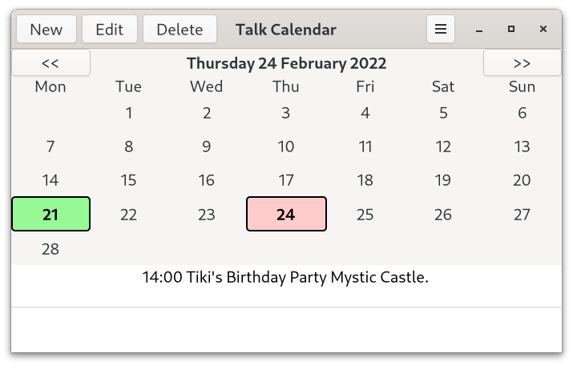

# Talk Calendar

Talk Calendar is a Linux desktop calendar with speech capability. 



Talk Calendar is free and open source and built with [Gtk](https://www.gtk.org/). It can be run by using the Debian binary  provided. Talk Calendar has been designed with assistive technologies in mind. This not only includes providing speech capability but also allows the system font size to be overridden to enlarge text when needed.

## Deployment

A binary package for 64-bit Debian based distributions can be downloaded from [bin-packages](https://github.com/crispinalan/talkcalendar/tree/main/bin-packages).  Alternatively, Talk Calendar can be built from source using the instructions below. 

To run Talk Calendar from the terminal use: 

```
./talkcalendar
```
You need to install the eSpeak speech synthesizer for audio output. 

With Debian, Ubuntu and derivatives use

```
sudo apt install espeak
```

With Fedora use

```
sudo dnf install espeak
```


Create a launcher (Mate desktop) or use a menu editor (Cinnamon desktop) to launch Talk Calendar and add Talk Calendar to your start-up programs to read out events when the computer is switched on.

Talk Calendar has been tested using the following 64-bit distributions.
```
Debian 11 (Bullseye) Mate Edition
Ubuntu Mate (Focal Fossa 20.04.3 LTS)
Linux Mint 20.2 Cinnamon Edition
Fedora 34
```

<ins>Note: </ins> If ./talkcalendar fails to run check that the Talk Calendar binary has read, write and executable permissions and if necessary change permissions using chmod (e.g. chmod +rwx filename). 

## Usage

### Adding New Event

* Double click on a date in the calendar to invoke the "New Event" dialog.
* Enter the event title, description notes, start and end times, repeat etc.
* Events are sorted by start time when displayed.
* A visual marker is placed on a day in the calendar which has an event.
* Navigate through the year using the calendar to add events.


### Editing Existing Event

* Double click the event in the treeview list below the calendar to edit.
* Change details as appropriate.

### Preferences

* Use the Preferences section in the hamburger menu to change options. 
* You can change:
```
Talk options
Font family and font size
Other options (holidays)
```

### Keyboard Shortcuts
```
Import		<Ctrl>O
Export		<Ctrl>S
Delete		<Ctrl>D
Speak		Spacebar
Today		Home Key
About		<Ctrl>A
Quit		<Ctrl>Q
```


### Talk

* Enable talking in Talk options (use hamburger menu)
* Click on a calendar date
* Press the spacebar to speak 

### Set Alarm

* Set the alarm time using the alarm button on the headerbar.


There is an option to show a pop-up desktop notification when an alarm is triggered.

An in-app alarm icon (splodge icon) appears in the headerbar when an alarm is triggered. The splodge icon persists until the set alarm button is pressed again. 


## Build From Source

The Talk Calendar source code is provided in the src directory.

You need the following dependencies:

```
sudo apt install build-essential
sudo apt install libgtk-3-dev
sudo apt install libsqlite3-dev
sudo apt install meson
sudo apt install ninja-build
sudo apt install flite1-dev
sudo apt install libasound2-dev
```
The [meson](https://mesonbuild.com/Quick-guide.html) build system is used. At the top level directory the build steps are:
```
meson build  (run once only)
ninja -C build
```


I used Geany as the IDE for developing the project as it has an integrated terminal and other features helpful for coding a Gtk3.0 project (see below). 

The Gtk3.0 reference manual can be viewed locally on a Linux computer using a program called Devhelp. Devhelp is a tool for browsing and searching Gtk API documentation. Having a local copy of the Gtk help documentation is very helpful when developing an application.

```
sudo apt install devhelp
```
## Versioning

[SemVer](http://semver.org/) is used for versioning. The version number has the form 0.0.0 representing major, minor and bug fix changes. 

## Author

* **Alan Crispin** [Github](https://github.com/crispinalan)


## License

GNU General Public Licence, version 2 or later (GPLv2+). 

## License Note

The Gtk 3.0 GUI toolkit is licensed using LGPLv2.1.  Consequently, Talk Calendar has been licensed using the GNU Lesser General Public License version 2 or later to be compatible with Gtk.  

When you combine software to produce a larger work both licenses should be compatible. This is relevant with regard to combining this software with an external speech synthesiser library.  Open source licenses and their compatibility is disussed in this [article](https://janelia-flyem.github.io/licenses.html).

The Pico speech synthesizer uses the Apache 2.0 license and this is not compatible with the GPLv2 licenses as discussed in this video [Compatibility in Open Source Licenses](https://www.youtube.com/watch?v=B0aMYeMv-8I). It explains that the Apache 2.0 license is compatible with just about everything except GPLv2 and LGPLv2.1 because it contains certain patent provisions that are inconsistent with these licenses. In fact the SVOX Pico speech synthesizer (libttspico-utils package) is in the Debian non-free archive which is not installed by default.  Debian say "The non-free archive area contains supplemental packages intended to work with the Debian distribution that do not comply with the DFSG* or have other problems that make their distribution problematic". 

The eSpeak speech synthesiser is licensed under GPLv3 which unbelievably is not compatible with [GPLv2](https://www.gnu.org/licenses/license-list.en.html). However, code that is released with a GPLv2 or later (GPLv2+) license can be combined with code from any later GPL version (unless the author says otherwise) as shown in the GNU compatibility [matrix](https://www.gnu.org/licenses/gpl-faq.html#AllCompatibility). The eSpeak speech synthesiser is an official Debian package and labeled [DFGS free](https://blends.debian.org/accessibility/tasks/speechsynthesis).

The Flite (Festival Lite) speech sythesiser has a BSD-like [license](https://github.com/festvox/flite/blob/master/COPYING) and is an official Debian package and labeled [DFGS free](https://blends.debian.org/accessibility/tasks/speechsynthesis). The BSD license is compatible with just about everything [Compatibility in Open Source Licenses](https://www.youtube.com/watch?v=B0aMYeMv-8I). Festival is a stand-alone speech synthesis program distributed with a free license but the voices however are not all free (the US voices, kal and ked are free).

DFGS = Debian Free Software Guidelines 

## Releases

Talk Calendar Version 1.1
```
built with Gtk3.0
uses own internal word concatenation speech synthesiser
sqlite used to store events locally
speaks date, event title keywords and priority 
options to change speak preferences
speak at startup option
keyboard bindings key_spacebar (speak) and key_home (today)
export events as csv file
import events from csv file
meson build system
binary for 64-bit Debian based distributions
```

Talk Calendar Version 1.2
```
built with Gtk3.0
option to change font family and font size
option to talk event start-time
clock
clock talk alarm
clock alarm notification 
binary for 64-bit Debian based distributions
```
Talk Calendar Version 1.3
```
built with Gtk3.0
replaced internal speech generator with Flite
internal code changes
binary for 64-bit Debian based distributions
```
<ins>Note: </ins> Export events before updating and then import.

Talk Calendar Version 1.4
```
built with Gtk3.0
new user interface using treeview display 
title bar replaced with headerbar
menu bar replaced with hamburger menu
replaced libnotify dependency with GNotification
font chooser dialog
alarm revealer
shortcut keys
binary for 64-bit Debian based distributions
```

Talk Calendar Version 1.4.1
```
built with Gtk3.0
removed implicit dependency on Flite library header files
generic binary for 64-bit distributions (Debian, Ubuntu, Fedora)
requires Flite to be install independently
```
Talk Calendar Version 1.4.2
```
built with Gtk3.0
replaced flite with espeak
generic binary for 64-bit distributions (Debian, Ubuntu, Fedora)
requires espeak to be install independently
```

## Roadmap
```
review text-to-speech approach
new features
full code review
package installer (deb)
```
## Project History and Notes

C++ and Qt were used to develop the original calendar diary project but when the Qt Company announced that Qt LTS versions and the offline installer were to become commercial-only [Qt licensing changes](https://www.qt.io/blog/qt-offering-changes-2020) I decided to completely re-write the project code from scratch by researching and using alternative GUI tool kits  such as [CopperSpice](https://www.copperspice.com/), [EFL](https://www.enlightenment.org/about-efl.md), [Flutter](https://flutter.dev/) and [Gtk](https://docs.gtk.org/gtk3/). Gtk seemed to be the best alternative to Qt for open source Linux development as the Gtk3 package is available in most Linux distributions. However, since the Qt Company moved Qt 5.15 LTS to a commercial-only phase KDE is now maintaining set of [patches](https://dot.kde.org/2021/04/06/announcing-kdes-qt-5-patch-collection) for Qt 5 [news](https://www.phoronix.com/scan.php?page=news_item&px=KDE-Qt-5-Patch-Collection). This has been welcomed by distributions such as KaOS who say in their recent [release](https://distrowatch.com/?newsid=11326) "Qt 5.15 does not receive updates or maintenance from the Qt company (only closed source, paid support is available). KDE has stepped up though and published a maintained 5.15 fork". Although it appears to be possible to use the KDE patches to update Qt I decided to use the open source Gtk toolkit to avoid any future commercial licensing issues. 

<ins>Version 1.3: </ins> The internal word concatenation based speech engine has been replaced with the Flite speech synthesis system. The gtk_widget_override_font function has been replaced with a custom CSS style, through an application-specific GtkStyleProvider to allow the application font size to be changed as an accessibility feature.  Both gtk_widget_modify_font and gtk_widget_override_font have been deprecated as Gtk say these functions are ["not useful in the context of CSS-based rendering"](https://docs.gtk.org/gtk3/method.Widget.override_font.html). The gtk_widget_override_font function is not listed when using the [Gtk 4.0 API](https://docs.gtk.org/gtk4/) search.

<ins>Version 1.4: </ins> In version 1.4 a Gtk Treeview is used for displaying events to simplify the user interface. Accelerator shortcut keys are used in place of overriding window key pressed. The title bar has been replaced with Gtk Headerbar. The idea of a Gtk Headerbar is to merge the titlebar, menu and toolbar into one area to save space but retaining the same functionality. Many Gnome applications already use Gtk Headerbar and Talk Calendar has adopted this approach.

In Gtk 4.0, GtkMenu, GtkMenuBar and GtkMenuItem are all gone and Gtk say ["these widgets were heavily relying on X11-centric concepts such as override-redirect windows and grabs, and were hard to adjust to other windowing systems"](https://docs.gtk.org/gtk4/migrating-3to4.html#gtkmenu-gtkmenubar-and-gtkmenuitem-are-gone). I can only guess this has something to do with the transistion from X11 to Wayland. Consquently, GtkMenu, GtkMenuBar and GtkMenuItem (classic menu) are no longer used in Talk Calendar. A GMenu hamburger style menu is used instead. Also GTkToolbar has been [removed](https://docs.gtk.org/gtk4/migrating-3to4.html#gtktoolbar-has-been-removed). This was another reason to use a Gtk Headerbar.

In the blog called [The GNOME Way](https://blogs.gnome.org/tbernard/2021/07/13/community-power-4/) they say "The traditional desktop is dead, and it’s not coming back"  and then "Instead of trying to bring back old concepts like menu bars or status icons, invent something better from first principles". Consequently, instead of developing an alarm desktop system status icon mechanism Talk Calendar uses an in-app alarm revealer (the splodge alarm triggered icon) in the headerbar which is shown when  an alarm is triggered. The splodge icon persists until the set alarm button is pressed again.

Talk Calendar has been using libnotify which is library for sending desktop alarm notifications. The libnotify library requires x11-libs. I have replaced libnotify desktop notifications with GNotification which is the Gtk mechanism for creating pop-up desktop notifications. Hopefully this will make the application easier to port to Gtk4/Wayland in the longer term.

Talk Calendar has been tested using Mate 1.26  (Ubuntu Mate 2.10 beta) as shown in the screenshot below.


This has raised the issue of default system themes and icons. With Talk Calendar tooltips are used when you hover over an icon button to describe its function. 

Adwaita is the default theme of the Gnome shell desktop and Gnome seem to be transitioning to using libadwaita, ["the GTK 4 port of libhandy that will play a central role in defining the visual language and user experience of GNOME applications"](https://adrienplazas.com/blog/2021/03/31/introducing-libadwaita.html). Libadwaita describes itself as the ["building blocks for modern GNOME applications"](https://gitlab.gnome.org/GNOME/libadwaita). It is not clear to me how this is going to play out with other desktops such as Mate. With Gtk 4.0 they say you should ["review your use of icon resources"](https://docs.gtk.org/gtk4/migrating-3to4.html#review-your-use-of-icon-resources) which is another thing to consider in future releases.

<ins>Version 1.4.1: </ins> The implicit dependency on the Flite library header files has been removed so that Flite has to be installed independently. This allows an older version of Flite to be used such as that used by Fedora 34. 

Talk Calendar has been tested with Fedora 34 Gnome live edition as shown in the screenshot below. 


<ins>Version 1.4.2: </ins> Replaced Flite speech synthesizer with eSpeak. This has to be installed independently. The older version of Flite (Flite 1.3) used by Fedora 34 and other distros has an EOF (end of file) issue causing overrun of audio. 

## Gtk 4.0 Migration

At time of writing Gtk 4.0 is not in the Debian or Ubuntu repositories. Gtk 4.0 is available with Fedora (including the Fedora Mate spin). Gtk4 is markedly different from Gtk3 and has a strong GNOME focus. Some initial testing reveals that migration will  require a great deal of code to be rewritten as there are many depreciations and other changes as outlined in the migrating from 3 to 4 [article](https://docs.gtk.org/gtk4/migrating-3to4.html). 

The first test build of the Gtk4 version of Talk Calendar developed using Fedora Mate 34 is shown below.


## Acknowledgements

* [Gtk](https://www.gtk.org/)
* GTK is a free and open-source project maintained by GNOME and an active community of contributors. GTK is released under the terms of the [GNU Lesser General Public License version 2.1](https://www.gnu.org/licenses/old-licenses/lgpl-2.1.html).

* [Geany](https://www.geany.org/)
* Geany is a small and lightweight Integrated Development Environment which only requires the GTK+ runtime libraries. With most Linux distrbutions Geany can be installed via the package manager. Alternatively it can be installed from source using the autotools based build system [Geany autotools build](https://www.geany.org/manual/current/#source-compilation). 
* It has features including syntax highlighting, code completion, auto completion of often used constructs (e.g. if, for and while), code folding, embedded terminal emulation and extensibility through plugins. The Geany IDE uses "tags" files for its autocompletion [tags](https://wiki.geany.org/tags/start). With Linux, these tag files (e.g. the gtk tag file) are copied to the config directory (./config/geany/tags/) to enable code completion. Geany uses the GPLv2 license. 

* [Sqlite](https://www.sqlite.org/index.html)
* SQLite is an in-process library that implements a self-contained, serverless, zero-configuration, transactional SQL database engine. SQLite.org say that: "SQLite is in the public domain and does not require a [license](https://www.sqlite.org/copyright.html)".

* [Alsa](https://www.alsa-project.org/wiki/Main_Page) 
* The Advanced Linux Sound Architecture (ALSA) provides audio and MIDI functionality to the Linux operating system. ALSA is  released under GPL-2.0-or-later and LGPL-2.1-or-later.  ALSA driver code is included in the  Linux kernel since 2.6.

* [Flite](http://www.festvox.org/flite/)
* Flite (festival-lite) is a small fast portable speech synthesis system developed from research at the Carnegie Mellon University and the University of Edinburgh. Details of the latest Debian packages can be found on the Bullseye package [page](https://packages.debian.org/source/bullseye/flite).  The latest C source code is on [github](https://github.com/festvox/flite). Flite is free software and the core code has a BSD-like [license](https://github.com/festvox/flite/blob/master/COPYING). It is an official Debian package and labeled [DFGS free](https://blends.debian.org/accessibility/tasks/speechsynthesis).

* [eSpeak](http://espeak.sourceforge.net/)
* eSpeak is a software speech synthesizer for English, and some other languages. eSpeak uses a "formant synthesis" method. It is an official Debian package and labeled [DFGS free](https://blends.debian.org/accessibility/tasks/speechsynthesis).


